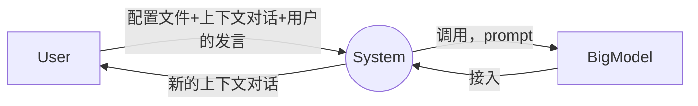
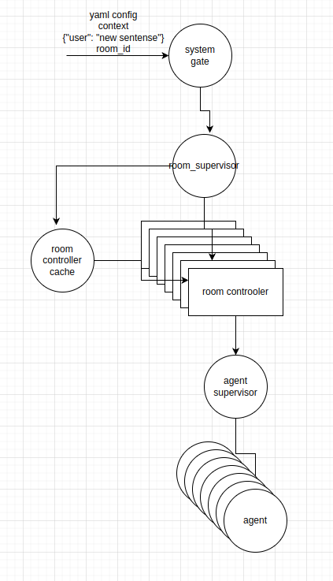
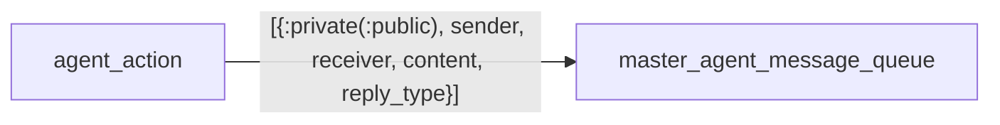
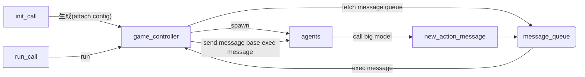

# werefox
## 1. 开发环境以及工具
    - ubuntu 20.04
    - elixir
    - phoenix
    - sveltekit

## 2 项目功能
### 2.1 产品定位
在多轮对话式游戏场景中，仅仅通过传入一个按照规范书写的配置文件，即可将该游戏运转起来。能够支持的场景有：
- [ ] 给定对话轮数，每一个角色的发言都是顺序的进行（终止条件就是对话达到最大轮次）
- [ ] 不给定对话轮数，给定一个终止条件，每一个角色都按照顺序进行发言和动作
- [ ] 给定一个终止条件，每一个角色的发言和动作是并发，不规定顺序

### 2.2 顶层数据流图

解释：
- 最开始的时候是没有上下文对话的，因此是空字符串
- 如果说这个游戏，是纯ai互相游戏，则用户发言每次都是空字符串
### 2.3 系统lifecyle


系统调用主要区分一下首次调用和后续调用：
- 首次调用，传入的context是一个空字符串，用户的对话的句子也是一个空的，room_id是空，因此room_cache会创建一个room_controller，room_controller会解析yaml的配置文件，生成一个智能体的supervisor，根据解析出来的yaml文件的信息生成若干个智能体在底部运行，room_cache返回对应的room进程的pid给上面的业务使用
-
- 非首次调用，传入的room id非空，yaml config为空，则请求接入，传入到room_cache查找到对应room name的id返回给上层调用者


### 2.4 系统的信息处理系统
当前整个系统中每一个room（也就是对于某一个游戏）而言，采用的是中心架构，也就是有一个master节点的概念，这个节点会存有一个消息队列

通过前端发起的一次run方法的调用，room_controller（也就是游戏的master节点）会从消息队列中拿出最前面那条信息进行处理，整个信息字段的含义是：
- :public/:private，表示这条数据是私有的还是会让其他的智能体知道
- sender，表示这条消息的发送方是哪个
- receiver，表示这条消息的接收方是哪个
- content，表示这条消息的内容，也就是大模型的文本输出结果
- reply_type，分成两种，reply/no_reply，前者表示如果receiver收到了数据之后，需要调用自己的大模型进行回复，回复的数据会进入到room_controller的消息队列中，如果是不需要回复的类型，则直接不做任何动作的输出。**组合得到四种消息类型：**
  - {:reply, :private} -> :private_ask
  - {:reply, :public} -> :public_ask
  - {:no_reply, :private} -> :private_info
  - {:no_reply, :public} -> :public_info

### 2.5 agent状态设计
共分九个字段：
- room_id，表示当前智能体属于哪个room，这里是一串16位的随机字符串
- index，如0，1，2，表示在这个room中，当前agent的索引
- indentity，这个字段有点奇妙，因为是狼人杀游戏，所以想要给每一个智能体的私有身份信息，强制要求第一次room_controller调用的时候，生成身份信息
- ai_bot，这个就是对大模型的一个封装，每次调用，强制要求的输出形式为
  ```
  "[{private: [{0: 1号猎人, 2号平民, 3号平民，4号平民, 5号狼人, 6号狼人, 7号预言家, 8号狼人, 9号女巫, #reply},{1:猎人#no_reply}, {2:平民#no_reply}, {3:平民#no_reply}, {4:平民#no_reply}, {5:狼人#no_reply}, {6:狼人#no_reply}, {7:预言家#no_reply}, {8:狼人#no_reply}, {9:女巫#no_reply}]}]"
  ```
- private_message，这个就是只有这个agent才知道的信息
- public_message，这个是所有智能体都知道的信息
- agent_list_message是读取yaml配置文件得到
- rule_prompt，这个算是游戏的规则提示词，从yaml配置文件读取得到
- end_game_prompt，这个是游戏结束的提示词，从yaml配置文件读取得到

对于各个智能体而言，每次调用大模型，会从agent_list_message中获取得到符合自己身份的提示词，然后将rule_prompt，end_game_prompt，private_message，public_message进行组合起来，然后喂给大模型。

### 2.6 整体的运转逻辑


### 2.7 改进部分
当前整体还是采用中心式的room controller通过从message_queue中每次yeild一条数据进行执行，相当于给游戏赋予了一个上帝，而且会游戏的性能瓶颈就会在这里产生。下一步改进方向为：
- 将message_queue从room controller中拿掉，然后给每一个agent都创建一个message_queue
- 由于每个智能体变成了独立处理数据，考虑情况，如果智能体A先收到了智能体B的信息，然后才收到智能体C的信息，但是实际处理顺序是先处理C的然后处理B的，这需要设计一个信息处理的协议才行
- 如何保证大模型的输出结果满足预先定义的数据形式是一个很大的挑战
### 2.8 使用方式
定义自己的game_config.yaml文件即可，难点在于需要很详细的考虑清楚整个游戏的运行逻辑，过于复杂的游戏可能会出错
