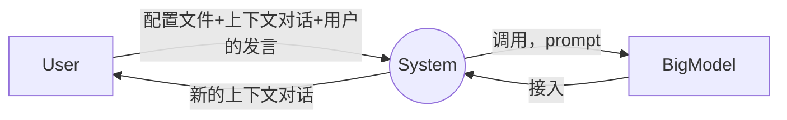

# werefox
## 1. 开发环境以及工具
    - ubuntu 20.04
    - elixir
    - phoenix
    - sveltekit
  
## 2 项目功能
### 2.1 产品定位
在多轮对话式游戏场景中，仅仅通过传入一个按照规范书写的配置文件，即可将该游戏运转起来。能够支持的场景有：
- [ ] 给定对话轮数，每一个角色的发言都是顺序的进行（终止条件就是对话达到最大轮次）
- [ ] 不给定对话轮数，给定一个终止条件，每一个角色都按照顺序进行发言和动作
- [ ] 给定一个终止条件，每一个角色的发言和动作是并发，不规定顺序

### 2.2 顶层数据流图

解释：
- 最开始的时候是没有上下文对话的，因此是空字符串
- 如果说这个游戏，是纯ai互相游戏，则用户发言每次都是空字符串
### 2.3 系统lifecyle


系统调用主要区分一下首次调用和后续调用：
- 首次调用，传入的context是一个空字符串，用户的对话的句子也是一个空的，room_id是空，因此room_cache会创建一个room_controller，room_controller会解析yaml的配置文件，生成一个智能体的supervisor，根据解析出来的yaml文件的信息生成若干个智能体在底部运行，room_cache返回对应的room进程的pid给上面的业务使用
- 
- 非首次调用，传入的room id非空，yaml config为空，则请求接入，传入到room_cache查找到对应room name的id返回给上层调用者


### 2.4 yaml的写法与运行逻辑
以狼人杀为例：
```
1. 描述狼人杀的规则
2. 主持者发起动作

```